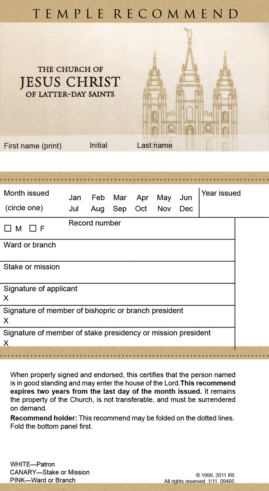

# LDS Temple Recommend Generator (Proof of Concept)
Generator here: [https://unhallowed-hand.github.io/](https://unhallowed-hand.github.io/)

**DISCLAIMER:** This generator and analysis is presented for entertainment and informational purposes, don't actually try to use it to get into a temple. Go watch the full 2 hour ceremony on YouTube if you want to know what it's all about.

This is a Proof of Concept temple recommend generator and security analysis for entering a Mormon temple, intended for the amusement of r/exmormon. This is based on my own experiences semi-regularly attending one temple as a TBM years ago and some insights from my exmo friend who worked at the same temple more recently (including the temple recommend desk).

**tl;dr**: Turns out you can pretty easily generate a blank recommend with any barcode number you want. If you printed it at the right size and marked the correct name, gender, and expiration date associated with that barcode then you could (probably? maybe?) get into a temple with it.

## Issuing a Recommend

Blank Temple Recommends (TRs) come in a large pre-printed "book," each with a unique barcode. The barcode is just a computer-readable representation of the 10-digit number that is printed next to it. Based on a few examples I was able to find of couples who got their TRs renewed at the same time by the same person, these barcode numbers are likely sequential. In other words, the next one in the book is just +1 from the previous one.

Somewhere TSCC maintains a TR database. A recommend is not considered active or valid until someone with Authority(TM) adds an entry to this database to associate the barcode number with a person and mark it as active/valid. It seems bishops and stake presidents, and maybe their counselors and/or secretaries, have access to do this through Leader and Clerk Resources (LCR) on TSCC website. This way if a TR book is stolen the blank recommends can't be used, and probably lets recommends be digitally revoked. Like if someone refuses to surrender theirs after getting caught watching Mormon Stories or porn.

Source: combination of personal experience and info on this rather interesting public forum: [https://tech.churchofjesuschrist.org/forum/viewtopic.php?t=39894](https://tech.churchofjesuschrist.org/forum/viewtopic.php?t=39894)

## The Desk

When you enter the temple you present your TR to the person at the front desk. According to my friend (as best as he could remember), that person is supposed to:

* Look at the name printed on the front
* Look at the issue date and ensure it's still valid (they're good for two years)
* Scan the barcode

At this point the computer system will look up the details of the recommend in the TR database. If it finds a match it will display "Brother" or "Sister" and then the name associated with that barcode in the database. If the TR in the database is expired or has another issue the screen will display some sort of warning.

If a warning appears the desk person is supposed to ask the TR owner to wait while they call for someone else to come deal with it. Resolving this usually involves looking up the contact info for the person's bishop or stake president (from a church database like LDS Tools?) and calling them. This probably resolves issues where a leader entered the wrong expiration date into the database or entirely forgot to activate the TR.

If the barcode fails to scan the desk person can manually enter the ten-digit barcode number printed on the recommend and the computer will do the same lookup.

If the database lookup succeeds and doesn't show any warnings, the desk person is supposed to make sure the name on the screen matches the one printed on the recommend. If it does, the person is admitted ~~into the presence of the Lord~~ inside the temple.

## Inside

Once inside everyone generally assumes you're allowed to be there, though you might have issues if you start wandering around worker areas where attendees have no business being.

## Security Features

With this process laid out we can identify the actual "security" measures that are in place. We do this by identifying which parts of the process are controlled entirely by TSCC and which parts a heathen could control or influence.

## TSCC Control

In this case, the database and systems for reading from it and writing to it are in complete control of TSCC. Unless you have a calling that gives you access to the database, you can't interact with that data. If you are one of those people with access, you could just issue yourself a completely valid recommend and be done with it.

## Our Control

The recommend itself is something we control because we could potentially make one with any kind of data we want. There seem to be some basic anti-forgery features in the paper that recommends come printed on (colored fibers and fine patterns), but since no one at the desk is checking those they're irrelevant for this analysis. Additionally, the forum linked above indicates that TSCC is moving towards a system where local leaders print recommends on normal paper, so clearly these anti-forgery properties aren't important.

## Security links

So what's the security link between what TSCC controls (what the desk person sees on their screen) and what we control (the paper recommend)? Four things: the barcode, the expiration date, the gender, and the name.

But we don't just want to get a recommend into the temple, we want to get a person into the temple. So how is the recommend linked to the person in this process? Only one thing: the gender. Normally that would be considered an extremely weak link given that it relies on a subjective analysis by the desk worker, but in this case TSCC's general bigotry slightly increases the security of this link: if you aren't clearly the "same" gender based on your appearance relative to traditional gender norms, you might get stopped.

## Attacking the links

Based on these links, getting past the recommend desk really comes down to a few key things:

* The barcode number must be linked to a a currently-valid recommend in the TR database
* The name printed on the front of the recommend must match the one displayed on the screen (retrieved from the database)
* The expiration date must correctly align with the one displayed on the screen (retrieved from the database)
* The person presenting the recommend must visually adhere to the traditional gender norms associated with the gender indicated on the screen (retrieved from the database)

Crucially, the only link in this security model that we can't directly modify is what information the database returns when a barcode is scanned (at least, not without getting into some very bad legal trouble). However, we CAN control what barcode is presented. **If someone can get the name, issue date, and 10-digit barcode number from an active recommend owned by someone whose sex matches their gender expression, a TR can be made that will likely grant access to the temple.**

## Generating a TR

A theoretical analysis is great, but practical demonstrations are so much cooler. So how hard is it to make your own TR?

Well, a quick Google images search will reveal a handful of pictures of recommends. Sadly, they all seem to be old enough that the layout has changed slightly. (Although there's a good chance the old guy at the desk wouldn't notice if you had one with that layout as long as the barcode scanned correctly...)

Fortunately, there are a lot of people who are more than happy to let you take a close look at their TR (expired or not, doesn't matter for this part). Some heathens might even let you take high-resolution picture with your smartphone camera!

## TR layout

With a decent photo and a bit of computer magic, you can discover these important elements of a TR layout:

* Height: 5.5 inches
* Width: 3 inches
* Font (for almost everything): Arial
   * TEMPLE RECOMMEND font at the top: HTC Deseret (custom); but there are a few very close look-alikes, notably Trajan Pro ([https://groups.google.com/g/lds-io/c/ojH5pIEfjXk?pli=1](https://groups.google.com/g/lds-io/c/ojH5pIEfjXk?pli=1))
   * TCOJCOLDS font: Custom typeface, but their logo is everywhere, just download an image of it
* Barcode type: ITF, 10 digits
   * Single line width-to-height ratio: approx 1:18
   * Numbers font: Arial
* Number of dots in the dotted lines: \~75

Now if you got an exceptionally good image of a valid recommend you could probably just print it directly, but that would require an image taken at almost exactly no angle and with the perfect white-balance or else it would immediately look fake. But with an OK photo you can deduce the information above and make a really good blank version that is the correct size when printed at 300DPI resolution: 

As discussed previously, the barcode is the key printed part of a TR as far as access control goes. Generating a barcode by hand is tedious, but computers can do it easily. In fact, there are a lot of free software libraries that will generate barcodes for you and allow you to customize pretty much every aspect of them. For this demo, I used the JsBarcode library, which can be imported directly into a webpage without needing to download anything: [https://github.com/lindell/JsBarcode](https://github.com/lindell/JsBarcode)

Throw together a few lines of HTML code to load the image, generate the barcode, and move it to the correct location over the image and you have yourself a stupid-easy way to generate a blank recommend image with any barcode number you want: [https://unhallowed-hand.github.io](https://unhallowed-hand.github.io)

I haven't actually tried printing this, and getting it to come out at the right size would be a bit tricky and probably require some trial and error. But to get 95% of the way there, you just need to:

* Generate the image
* Open the Print dialog in your web broswer
* Set the Margins to None
* For a 8.5x11 paper, set the scale to 32

## Other considerations

My analysis was focused primarily on the technical security of the temple recommend. However, there are a few other non-technical security things to be aware of:

* If someone who knew you and knew that you weren't supposed to have a recommend saw you inside, you could have problems.
* If you continued to go by the name on the recommend (if it's not the same as yours) and someone who knew you noticed, you could have problems.
* If you went by a different name while inside and the person who was at the desk noticed later, you could have problems.
* If the desk person knows the person whose name is on your recommend, you could have problems.

Things might have changed since I and my worker friend last attended the temple. Things also might work differently at different temples (though I personally doubt it given how much TSCC tries to standardize things).

You'd almost certainly need to print this on a laser printer (one that uses toner) and not an Inkjet printer because Inkjet printers universally suck and it would probably look really fake.

As I mentioned previously, it seems TSCC seems to be moving towards a system where local units can print their own recommends on normal paper. This means that

1. This TR style/layout might not be in use for much longer, but
2. Printing your own custom copy would be much easier if/when they make the switch since a LOT of units are still using crappy inkjet printers from the 1990's.

**REMINDER:** This information is presented  for entertainment, don't actually use it try to get into the temple. Use it to prank your TBM family and make them think you've returned to the ~~cult~~ fold or something like that.
